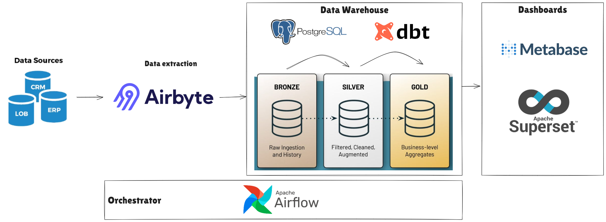
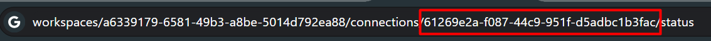

# Projeto Modern Data Stack



Este projeto é uma solução completa para ingestão, processamento e visualização de dados utilizando diversas ferramentas como Airbyte, Airflow, DBT, Metabase e Superset. A arquitetura foi desenhada para permitir flexibilidade e escalabilidade no tratamento de grandes volumes de dados.

## Sumário

- [Visão Geral](#visão-geral)
- [Pré-requisitos](#pré-requisitos)
- [Instalação](#instalação)
- [Como Rodar o Projeto](#como-rodar-o-projeto)
- [Configuração das Conexões](#configuração-das-conexões)
  - [Conectando Airbyte e Airflow](#conectando-airbyte-e-airflow)
  - [Configurando Conexão do Postgres com DBT](#configurando-conexão-do-postgres-com-dbt)
  - [Subir e Conectar Metabase e Superset](#subir-e-conectar-metabase-e-superset)
- [Documentações Úteis](#documentações-úteis)

## Visão Geral

Este projeto integra diversas ferramentas de ETL, orquestração de pipelines, e visualização de dados, com foco na eficiência e automação do processo de movimentação e análise de dados.

## Pré-requisitos

Antes de começar, certifique-se de ter as seguintes ferramentas instaladas:

- Docker e Docker Compose
- Make
- Python 3.8+

## Instalação

Clone este repositório e entre no diretório do projeto:

```bash
git clone https://github.com/ViniPMartins/modern-data-stack.git
cd modern-data-stack
```

## Como Rodar o projeto

Para subir o projeto completo, rodar o seguinte comando:
```
make all -B
```
O parâmetro `-B` garante que todos os passos serão rodados pelo make.

Em seguida, seguir as seguintes instruções para configuração:

## Conectando Airbyte e Airflow

1. **Criar conexão no airbyte:**
    Configurar as origens dos dados de acordo com os conectores do Airbyte.
    Como destino, setar os seguintes parâmetros:

        - host: 127.0.0.1
        - port: 5435
        - dbname: postgres
        - schema: bronze (Você pode definir outros nomes de schema se quiser)
        - username: postgres
        - password: postgres

    Estes parâmetros aproveitam o banco de dados do próprio Airflow. Caso deseje conectar em outro banco, alterar esses parâmetros.

2. **Criar conexão no Airflow:**
    No Airflow, ir em Admin > Connections, e adicionar uma nova conexão com os seguintes parâmetros:

        - ConnectionId: airbyte
        - Connection Type: Airbyte
        - Host: airbyte-proxy
        - login: airbyte
        - password: password

    Esse são os logins padrão do airbyte. caso altera essas informações de login (ver documentação citada mais abaixo), colocar as mesmas credenciais nesta conexão.

3. **Setar o Connection ID do airbyte na DAG do airflow:**
    Para saber o Connection ID do airbyte, entre na conexão que deseja e, no link, pegar o código após o `/connections/[Connection ID]`

    

    Com o código copiado, ir até o código da dag do airbyte e colar na variável `AIRBYTE_CONNECTION_ID`
    Após esses passos, já é possível orquestrar o Airbyte via Airflows

    Esse tutorial pode ser visto mais em detalhes [nesta documentação](https://airbyte.com/tutorials/how-to-use-airflow-and-airbyte-together#test-the-api-endpoints-with-curl).
     
## Configurando conexão do postgres com DBT

1. **Criar conexão no Airflow com o Postgres**
    Para que o DBT rode os seus processos corretamente, é necessário criar uma conexão no Airflow com o Postgres.
    Para isso, no Airflow, ir em Admin > Connections, e adicionar uma nova conexão com os seguintes parâmetros:

        - ConnectionId: airflow_db
        - Connection Type: Postgres
        - Host: postgres
        - dbname: postgres
        - login: postgres
        - password: postgres

    Relembrando, estes parâmetros aproveitam o banco de dados do próprio Airflow. Caso deseje conectar em outro banco, alterar esses parâmetros.

## Subir e Conectar Metabase e o Superset
1. **Metabase**:
    O metabase está configurado para subir junto ao airflow com o astro-cli. Ao subir o metabase, realizar um primeiro cadastro e conectar no database com as mesmas credenciais da conexão do airflow e já estará pronto para uso:

        - Host: postgres
        - dbname: postgres
        - login: postgres
        - password: postgres

2. **Superset**:
    O Superset subirá já com as redes do docker conectadas, o que possibilita a conexão utlizando as mesmas credenciais citadas acima no metabase.

# Documentações úteis

## Airbyte
[Link para a documentação](https://docs.airbyte.com/deploying-airbyte/docker-compose)

## Airflow
Se precisar instalar o Astro Cli, ver [essa documentação](https://www.astronomer.io/docs/astro/cli/install-cli)
Caso tenha conflito de portas, olhar [essa documentação](https://www.astronomer.io/docs/astro/cli/troubleshoot-locally#ports-are-not-available-for-my-local-airflow-webserver)

